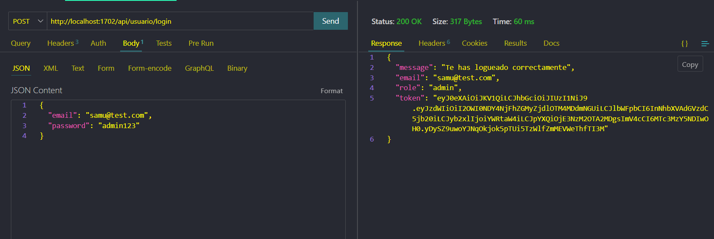
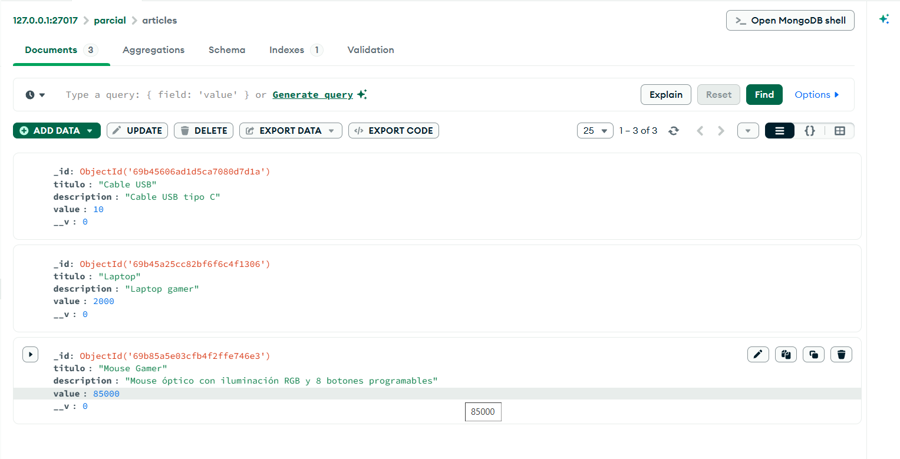

<div align="center">

# Parcial-Desarrollo-Web


<details>
<summary>Más Capturas</summary>

|        http        |       db       |
| :-----------------: | :-------------: |
|  |  |

</details>

</div>

## **Índice**

1. [**Descripción**](#descripción)
2. [**Instalación**](#instalación)
3. [**Herramientas utilizadas**](#herramientas-utilizadas)
4. [**Uso**](#uso)
   - [**Notas de seguridad**](#notas-de-seguridad)
   - [**Endpoints disponibles**](#endpoints-disponibles)
     - [**Usuarios**](#usuarios)
     - [**Artículos**](#artículos)
   - [**Importar datos de prueba**](#importar-datos-de-prueba)
5. [**Arquitectura**](#arquitectura)
6. [**Requisitos**](#requisitos)
7. [**Licencia**](#licencia)
8. [**Autores**](#autores)

## **Descripción**

Este proyecto es un **backend básico** desarrollado en **Node.js** con **Express**, diseñado
para la gestión de usuarios y artículos mediante un sistema de **autenticación y autorización
basado en roles**.

### Características principales

- **Autenticación con JWT**: El sistema genera un token de sesión cuya duración es
  configurable a través de variables de entorno (`.env`). Este token debe incluirse en la
  cabecera de cada solicitud a rutas protegidas.
- **Manejo de roles**: Implementa roles de usuario `admin` y `standard`. Los privilegios
  de creación, edición y eliminación de artículos están reservados exclusivamente para los
  administradores.
- **Protección de rutas**: Las rutas sensibles cuentan con un middleware de seguridad
  que valida la autenticidad del token antes de permitir el acceso a los recursos.
- **CRUD de artículos**: Permite la gestión completa de artículos por parte de los
  administradores. Todos los usuarios pueden realizar consultas generales o búsquedas por ID.
- **Gestión de usuarios**: Registro abierto para nuevos usuarios y sistema de login que
  retorna el token de acceso necesario para interactuar con la API.

## **Instalación**

### Pasos

**1. Clona el repositorio**

```bash
git clone https://github.com/Mogollo7/Parcial-Desarrollo-Web.git
```

**2. Entra a la carpeta del proyecto**

> [!IMPORTANT]
> Asegúrese de que esté en la carpeta raíz para ejecutar el backend.

```bash
cd Parcial-Desarrollo-Web
```

**3. Instala las dependencias**

```bash
npm install
```

**4. Inicia MongoDB** abre una terminal y ejecuta el comando en la ruta raíz de la instalación de MongoDB:

```bash
mongod
```

**5. Inicia el servidor**

```bash
node index.js
```

**6. Verifica que el servidor esté corriendo**

> [!NOTE]
> Si tiene el puerto ocupado, ciérrelo y cámbielo en el archivo `.env` que está disponible para una fácil ejecución.

```
Conexión exitosa corriendo en el puerto 1702
```

## **Herramientas utilizadas**

- **JavaScript**: Lenguaje de programación principal usado para desarrollar toda la lógica del backend.
- **Node.js**: Entorno de ejecución de JavaScript del lado del servidor que permite correr el proyecto fuera del navegador.
- **Express**: Framework de Node.js utilizado para crear el servidor, gestionar rutas y middlewares de forma sencilla.
- **MongoDB**: Base de datos NoSQL orientada a documentos donde se almacenan los usuarios y artículos del sistema.
- **Mongoose**: Librería de Node.js que facilita la conexión y el manejo de MongoDB mediante esquemas y modelos.
- **JWT (jwt-simple)**: Librería para la creación y validación de tokens de autenticación JSON Web Token.
- **bcryptjs**: Librería utilizada para encriptar las contraseñas de los usuarios antes de guardarlas en la base de datos.
- **Moment.js**: Librería para el manejo de fechas y tiempos, usada para definir la expiración de los tokens JWT.
- **dotenv**: Permite cargar variables de entorno desde el archivo `.env` para mantener datos sensibles fuera del código.
- **body-parser**: Middleware que permite leer y procesar el cuerpo de las solicitudes HTTP en formato JSON.
- **cors**: Middleware que habilita el intercambio de recursos entre diferentes dominios (Cross-Origin Resource Sharing).

## **Uso**

Para probar este proyecto, asegúrate de tener el servidor corriendo, **MongoDB** activo y una herramienta como **Postman** o **Thunder Client** para realizar las solicitudes.

En la carpeta `data/` se encontrara archivos listos para usar:

- `parcial.users.json` y `parcial.articles.json`: pueden importarse directamente a MongoDB para tener datos de prueba.
- `usuarios.txt`: contiene credenciales de prueba **sin hashear**, separadas por rol (`admin` y `standard`), para que puedas iniciar sesión rápidamente.

---

### Notas de seguridad

- **Contraseñas:** En la base de datos las contraseñas se guardan **hasheadas**. Si insertas usuarios manualmente en la base de datos sin usar el endpoint de registro, el login no funcionará correctamente.
- **Roles:** Si al registrar un usuario no se envía el campo `"role"`, el sistema asignará automáticamente el rol **`standard`**.
- **Permisos:** Solo los usuarios con rol **`admin`** pueden crear, actualizar o eliminar artículos.

---

### Endpoints disponibles

#### Usuarios

| Acción   | Método  | Endpoint          | Descripción                                                        |
| --------- | -------- | ----------------- | ------------------------------------------------------------------- |
| Registrar | `POST` | `/api/register` | Crea un usuario. Si no se especifica `role`, será `standard`.  |
| Login     | `POST` | `/api/login`    | Devuelve un**token JWT** necesario para las rutas protegidas. |

Ejemplo de registro:

```http
POST http://localhost:1702/api/register
```

```json
{
  "email": "nuevo@email.com",
  "password": "123456",
  "role": "admin"
}
```

El login devuelve un **token JWT** que debe enviarse en las solicitudes protegidas mediante el header:

```http
Authorization: Bearer <token>
```

---

#### Artículos

| Acción       | Método    | Endpoint                    | Acceso     |
| ------------- | ---------- | --------------------------- | ---------- |
| Listar todos  | `GET`    | `/api/articles`           | Público   |
| Buscar por ID | `GET`    | `/api/article/:articleId` | Público   |
| Crear         | `POST`   | `/api/article`            | Solo admin |
| Actualizar    | `PUT`    | `/api/article/:articleId` | Solo admin |
| Eliminar      | `DELETE` | `/api/article/:articleId` | Solo admin |

Ejemplo de creación de artículo:

```http
POST http://localhost:1702/api/article
Authorization: Bearer <token>

```

> [!NOTE]
> El Bearer se elimina junto con las comillas si lo copia

```json
{
  "titulo": "Artículo de prueba",
  "description": "Descripción del artículo",
  "value": 100
}
```

---

### Importar datos de prueba

Si prefieres no registrar usuarios manualmente, puedes importar los archivos de la carpeta `data/` usando los siguientes comandos:

```bash
# Importar usuarios
mongoimport --db parcial --collection users --file data/parcial.users.json --jsonArray

# Importar artículos
mongoimport --db parcial --collection articles --file data/parcial.articles.json --jsonArray
```

Para iniciar sesión con los usuarios importados desde `parcial.users.json`, utiliza las contraseñas en texto plano que se encuentran en el archivo `users.txt`.

## **Arquitectura**

La arquitectura del proyecto se basa en una estructura modular para un backend en Node.js con Express.

```
Parcial-Desarrollo-Web/
├── application.js                 # Configuración de la aplicación Express
├── index.js                       # Archivo principal que inicia el servidor
├── package.json                   # Dependencias y scripts del proyecto
├── README.md                      # Documentación del proyecto
├── LICENSE                        # Licencia del proyecto
├── controllers/
│   ├── articles.js                # Lógica de negocio para artículos
│   └── users.js                   # Lógica de negocio para usuarios
├── data/
│   ├── parcial.articles.json      # Datos de prueba para artículos
│   ├── parcial.users.json         # Datos de prueba para usuarios
│   └── usuario.txt                # Credenciales de prueba
├── helpers/
│   └── auth.js                    # Utilidades de autenticación JWT
├── img/
│   ├── diagram.png                # Diagrama de la arquitectura
│   ├── http.png                   # Captura de HTTP
│   └── db.png                     # Captura de base de datos
├── models/
│   ├── articles.js                # Modelo de Mongoose para artículos
│   └── users.js                   # Modelo de Mongoose para usuarios
└── routes/
    ├── articles.js                # Rutas de la API para artículos
    └── users.js                   # Rutas de la API para usuarios
```

## **Requisitos**

Asegúrate de tener instalado:

- [Node.js](https://nodejs.org/en) (v24 o superior)
- [MongoDB](https://www.mongodb.com/try/download/community) (local o Atlas)
- [Postman](https://www.postman.com/downloads/) o [Thunder Client](https://www.thunderclient.com/)

## **Licencia**

Este proyecto está licenciado bajo la **MIT License**.

## Autores


<br>
<sub><b>Juan Sebastian Martínez Galeano</b></sub>
</a>

<br>
<sub><b>Samuel Usma Brand</b></sub>
</a>

<br>
<sub><b>Cesar Alberto Ocampo Raigosa</b></sub>
</a>


